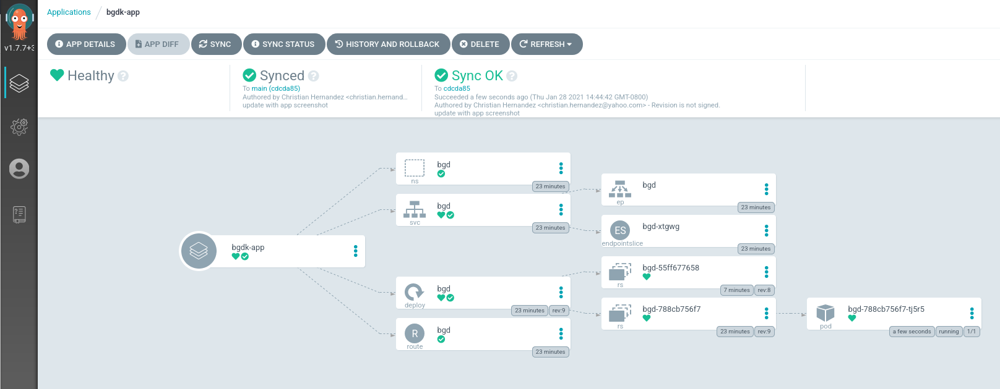
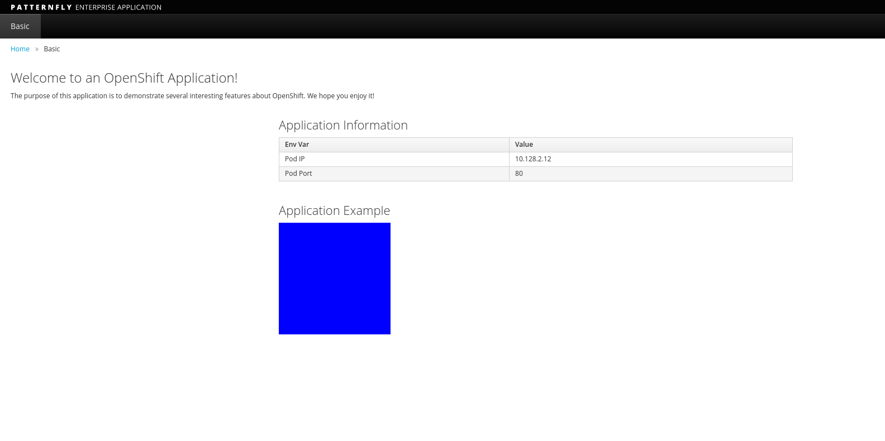

## Exploring the OpenShift GitOps Operator

https://developers.redhat.com/courses/gitops/getting-started-argocd-and-openshift-gitops-operator

oc get pods -n openshift-console | grep console

oc get routes console -n openshift-console

oc get operators

`oc get routes -n openshift-gitops | grep openshift-gitops-server | awk '{print $2}'`

  openshift-gitops-server-openshift-gitops.apps.ocp1.ntnxlab.local

`oc extract secret/openshift-gitops-cluster -n openshift-gitops --to=-`

`ARGOCD_SERVER_URL=$(oc get routes -n openshift-gitops | grep openshift-gitops-server | awk '{print $2}')`

argocd login $ARGOCD_SERVER_URL
argocd cluster list

## Deploying a Sample Application

In this environment, we have some example manifesets taken from our [sample GitOps repo](https://github.com/redhat-developer-demos/openshift-gitops-examples). We'll be uisng this repo to test. These manifests include:

A Namespace: bgd-ns.yaml
A Deployment: bgd-deployment.yaml
A Service: bgd-svc.yaml
A Route: bgd-route.yaml

Collectively, this is known as an Application within ArgoCD. Therefore, you must define it as such in order to apply these manifest in your cluster.

Open up the Argo CD Application manifest: bgd-app.yaml

Let's break this down a bit.

ArgoCD's concept of a Project is different than OpenShift's. Here you're installing the application in ArgoCD's default project (.spec.project). NOT OpenShift's default project.
The destination server is the server we installed ArgoCD on (noted as .spec.destination.server).
The manifest repo where the YAML resides and the path to look for the YAML is under .spec.source.
The .spec.syncPolicy is set to false. Note that you can have Argo CD automatically sync the repo.
The last section .spec.sync just says what are you comparing the repo to. (Basically "Compare the running config to the desired config")
The Application CR (CustomResource) can be applied by running the following:

`oc apply -f https://raw.githubusercontent.com/redhat-developer-demos/openshift-gitops-examples/main/components/applications/bgd-app.yaml`


oc get pods,svc,route -n bgd

oc rollout status deploy/bgd -n bgd

oc get route -n bgd


oc -n bgd patch deploy/bgd --type='json' -p='[{"op": "replace", "path": "/spec/template/spec/containers/0/env/0/value", "value":"green"}]'

oc rollout status deploy/bgd -n bgd

> It's now out of sync in UI

You can sync your app via the Argo CD by:

First clicking `SYNC`
Then clicking `SYNCHRONIZE`

After the sync process is done, the Argo CD UI should mark the application as in sync.



If you reload the page on the tab where the application is running. It should have returned to a blue square.



argocd app sync bgd-app

You can setup Argo CD to automatically correct drift by setting the Application manifest to do so. Here is an example snippet:

```
spec:
  syncPolicy:
    automated:
      prune: true
      selfHeal: true
```